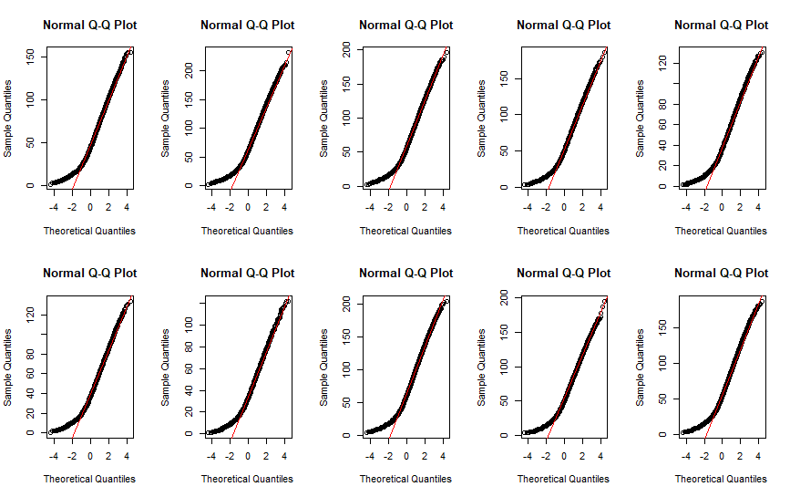
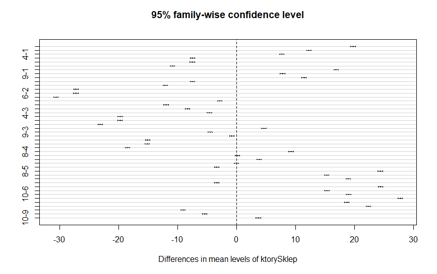
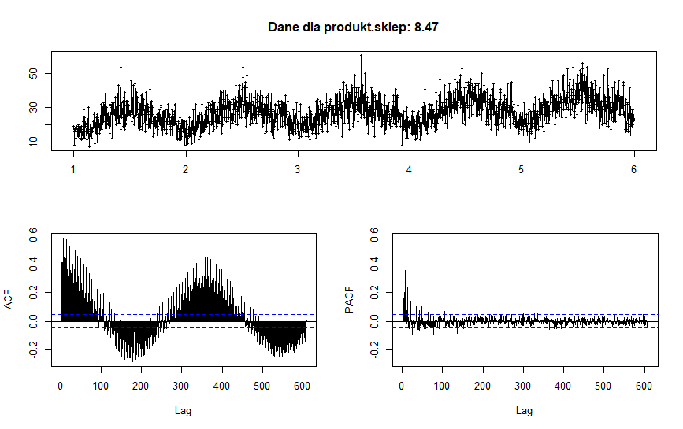
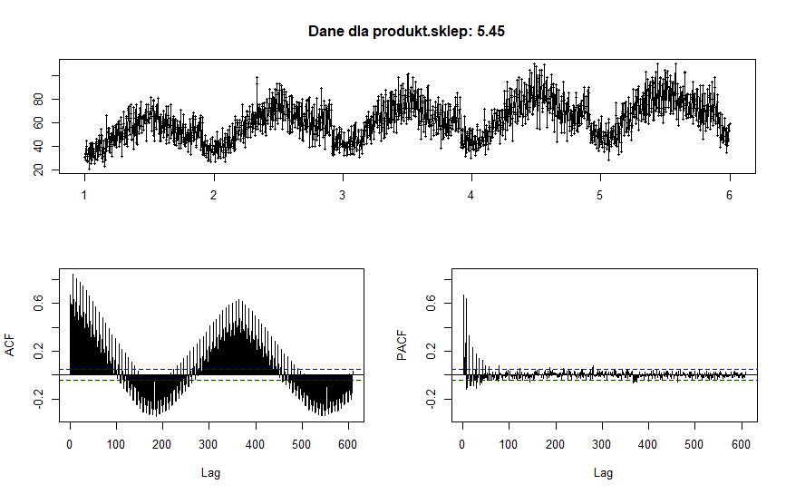
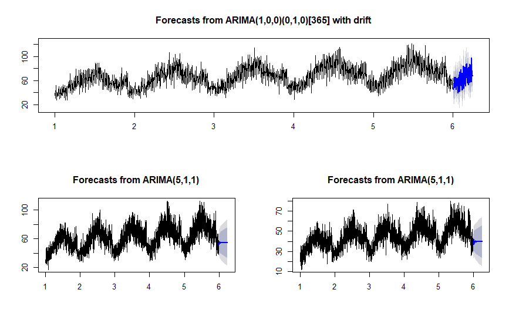

```{r setup, include=FALSE}
library(knitr)
opts_chunk$set(echo = TRUE)
opts_chunk$set(eval=FALSE)
```

# Opis zadania

Nasza grupa podjęła się rozwiązania zadanie z portalu kaggle.com ([link](https://www.kaggle.com/c/demand-forecasting-kernels-only/overview?fbclid=IwAR1_03Sg2Zzgsaez4v6itwCSZE_B_TEBMLUUm8ogfp8_ZF5cjcsRGo0I3cg)), które polegało na zbadaniu różnych technik szeregów czasowych na stosunkowo prostym i czystym zbiorze danych.

Na podstawie danych z 5 lat, należało zaproponować prognozę sprzedaży na najbliższe 3 miesiące dla 50 różnych produktów w 10 różnych sklepach.

Od razu nasunęło nam się pytanie- jak różni się średnia sprzedaż w poszczególnych sklepach? Być może jesteśmy w stanie modelować pewne pary sklepów tak samo? Zadanie rozpoczęliśmy więc od przeprowadzenia analizy wariancji (R skrypt- `analiza_srednich_w_grupach.R`). Następnie w skrypcie `szeregi_analiza_cech.R` stworzyliśmy interesujące nasz szeregi czasowe i dokonaliśmy ich analizy, po to by następnie w skrypcie `modele_i_predykcja.R` dokonać prognozy. Nasz projekt składa się więc z trzech współpracujących ze sobą R-skryptów, które wykorzystują pliki RDS do "przenoszenia danych"" między sobą oraz z dodatkowego R-skryptu definiującego używane w projekcie funkcje. 

#Funkcje
Poniżej pokażemy i opiszemy działanie wszystkich funkcji, które zostały zdefiniowane w celu zoptymalizowania kodu użytego w projekcie. 

#### Funkcja `qq`

Funkcja rysująca wykresy qqnorm i qqline.
```{r}
qq <- function(x) {
    qqnorm(x)
    qqline(x, col = "red")
}
```

#### Funkcja `shapiro_pvalue`

Funkcja wykonująca Shapiro test i printująca jedynie p-value. Dodatkowo, dla zbyt dużych zbiorów danych, pobiera próbkę o długości maksymalnej dla tego testu i na niej wykonuje test. Nie zminiejsza to ogólności.

```{r}
shapiro_pvalue <- function(x) {
    if (length(x) > 5e3) {
        o <- sample(length(x), 5e3)
        x <- x[o]
    }
    shapiro.test(x)$p.value
}
```

#### Funkcja `analiza_produktu` 

Funkcja, która dla listy wykonuje boxplot z podziałem na sklepy,
weryfikację normalności rozkładu oraz ANOVE i test Tukey'a oraz
wypisanie par, dla ktorych rożnice średniej nie są istotne
statystycznie.

```{r}
analiza_produktu <- function(x, alfa = 0.05) {

    produkt <- x[["item"]][[1]]
    print(paste("Analiza produktu", produkt))

    sprzedaz_p <- sprzedaz[ktoryProdukt == as.character(produkt)]
    sklep_p <- sklep[ktoryProdukt == as.character(produkt)]

    ktorySklep_p <- factor(sklep_p, levels = c("1":"10"))

    boxplot(sprzedaz_p ~ ktorySklep_p, xlab = "Numer sklepu",
            ylab = paste("Sprzedaż produktu", as.character(produkt)),
            col = brewer.pal(n = 10, name = "PiYG"))
    points(1:10, by(sprzedaz_p, ktorySklep_p, mean), pch = 15)
    by(sprzedaz_p,  sklep_p, mean)

    print("Sprawdzenie normalnosci dla produktu, z podzialem na sklepy.")

    x %>% group_by(store) %>%
        summarize(
            p_value = shapiro_pvalue(sales)) %>%
        print()

    print("W celu dalszych badan zalozmy jednak, że kazda proba pochodzi z rozkladu zblizonego do rozkladu normalnego. Teraz wykonamy analize wariancji i testy post hoc.")

    anova(lm(sprzedaz_p ~ ktorySklep_p))
    t <- TukeyHSD(aov(sprzedaz_p~ktorySklep_p), conf.level = 1 - alfa)
    p_values <- t[["ktorySklep_p"]][ , 4]
    istotne <- which(p_values >= alfa)
    print("Pary, dla których śrendie nie różnią się istotnie statystycznie")
    print(names(istotne))
}
```


#### Funkcja `zamiana_sklepow`

Funkcja, która dla podzielonych na produkty danych dokonuje zamiany
sklepu 10 na 3, 9 na 4, 6 na 5 oraz jako sales bierze średnią
z sales dla obu złączonych sklepów.

```{r}
zamiana_sklepow <- function(x, domyslna, zmieniana) {

    #x to wstępne dane
    x %>%
        filter(store == domyslna) %>%
        select(sales) -> kol1
    x %>%
        filter(store == zmieniana) %>%
        select(sales) -> kol2

    #średnia dla dwóch złączanych kolumn
    kolumna_wyjsciowa <- (kol1 + kol2) / 2

    #usuwamy dane z drugim sklepem
    x %>%
        filter(store != zmieniana) -> usuniete_zmieniane

    indeksy <- which(usuniete_zmieniane$store == domyslna)

    #wklejamy średnie w wiersze z pierwszego sklepu
    usuniete_zmieniane[indeksy, 4] <- kolumna_wyjsciowa

    return(usuniete_zmieniane)
}
```

# Analiza średnich w grupach
#### Wczytanie danych 
```{r}
dane <- read.csv(sciezka_pliku)

sklep <- dane$store
produkt <- dane$item
sprzedaz <- dane$sales

ktoryProdukt <- factor(produkt, levels = c("1":"50"))
ktorySklep <- factor(sklep, levels = c("1":"10"))

head(dane)
```

#### Czy istnieje sklep którego średnia sprzedaż różni się istotnie statystycznie od sprzedaży w innych sklepach?


Już na powyższym wykresie pudełkowym możemy zauważyć, że niektóre pary sklepów mają podobną średnią sprzedaż. 
 
##### Normalność rozkładu
W następnym kroku sprawdziliśmy założenie dotyczące normalności rozkładu wszystkich zmiennych losowych oraz za pomocą testu Saphiro - normalność danych z podziałem na sklepy.

<center>

</center>



`p-value` z testu Saphiro okazały się bardzo niskie dla wszystkich sklepów, jednak założyliśmy, że mimo braku normalności możemy potraktować ANOVĘ jako odpowiednią metodę.
W następnym kroku przeprowadziliśmy ANOVĘ oraz test Tukey'a.



#### Wniosek
Średnia sprzedaż produktów okazała się podobna dla następujących par sklepów: _9-4, 6-5_.

#### Czy istnieje produkt którego średnia sprzedaż różni się istotnie statystycznie od sprzedaży w innych sklepach? 

Aby rozpocząć taką analizę, podzieliliśmy nasze dane ze względu na produkty i sklepy, otrzymując w ten sposób 50 list opisujących sprzedaże poszczególnych produktów. Następnie dokonaliśmy analogicznej analizy tj. wygenerowanie boxplotów dla danego produktu z podziałem na sklepy, dokonanie sprawdzenia normalności rozkładu oraz wykonanie analizy wariancji i testu Tukey'a.


#### Wniosek 
Wnioskiem, jaki mogliśmy wyciągnąć z tej analizy, było to, że średnia sprzedaż produktów jest podobna dla następujących par sklepów: _9-4, 10-3, 6-5_. Zatem dla uproszczenia, w procesie tworzenia modeli i prognozowania zdecydowaliśmy się potraktować dane ze sklepów 10, 9 i 6 łącznie z danymi ze sklepów odpowiednio 3, 4, 5. Do naszej nowej ramki danych zostały wczytane średnie ze sprzedaży w danym dniu w odpowiadających sobie sklepów. Tym samym wiersze dla sklepów 6, 9, 10 zostały usunięte. Ogarniczyło nam to chociaż minimalnie liczbę modeli, które musieliśmy stworzyć.

# Analiza cech szeregów
W kolejnym etapie skupiliśmy się na narysowaniu wykresów danych, znalezieniu potencjalnej
sezonowości i stworzeniu szeregów czasowych. Po wykonaniu tych czynności
mogliśmy zająć się szukaniem odpowiednich modeli.

Wykonaliśmy wykresy za pomocą funckji `tsdisplay()` aby zobaczyć wykresy `acf` i `pacf`. Przykładowe wykresy poniżej:





Dla każdego szeregu przeprowadziliśmy test rozstrzygający o stacjonarności (`adf.test()`). 
Dla wyżej wymienionego testu hipotezą zerową jest, że szereg nie
jest stacjonarny, dlatego wypisaliśmy p-value oraz stworzyliśmy wektor `d`, który
przechowywał informację czy szereg powinien być różnicowany przy tworzeniu
modelu czy nie. 

Po wykonaniu tych czynności zajęliśmy się szukaniem odpowiednich modeli.

Z powyższych wykresów zaobserwowaliśmy wyraźną sezonowość dla wszystkich produktów (roczną) oraz trend rosnący. Nasze dane także całkiem nieźle zachowują się na wykresie `pacf`, co sugeruje użycie modelu `AR(p)`.

Przeprowadzone analizy pozwoliły nam zredukować dane oraz wysnuć wnioski o stacjonarnosci. 

Kolejnym i ostatnim krokiem było stworzenie modeli i dokonanie predykcji.

# Tworzenie modeli i predykcja

Na tym etapie dokonaliśmy utworzenia modeli korzystając z funkcji `auto.arima` oraz uzupełniliśmy plik testowy o predykowane na ich podstawie wartości. Wykresy przykładowych predykcji poniżej:


Mając na uwadze pominięcie predykcji dla sklepów 6(=5), 9(=4), 10(=3), wartości predykowane dla sklepów 5, 4, 3 zostały wczytane zarówno dla tych sklepów jak i ich odpowiedników (6, 9, 10).


