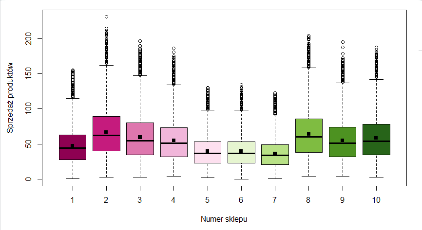

```{r setup, include=FALSE}
knitr::opts_chunk$set(echo = FALSE)
```

#Opis zadania

Nasza grupa podjęła się rozwiązania zadanie z portalu kaggle.com ([link](https://www.kaggle.com/c/demand-forecasting-kernels-only/overview?fbclid=IwAR1_03Sg2Zzgsaez4v6itwCSZE_B_TEBMLUUm8ogfp8_ZF5cjcsRGo0I3cg)), które polegało na zbadaniu różnych technik szeregów czasowych na stosunkowo prostym i czystym zbiorze danych.

Na podstawie danych z 5 lat, należało zaproponować prognozę sprzedaży na najbliższe 3 miesiące dla 50 różnych produktów w 10 różnych sklepach.

Od razu nasunęło nam się pytanie- jak różni się średnia sprzedaż w poszczególnych sklepach? Być może jesteśmy w stanie modelować pewne pary sklepów tak samo? Zadanie rozpoczęliśmy więc od przeprowadzenia analizy wariancji (R skrypt- `analiza_srednich_w_grupach.R`). Następnie w skrypcie `szeregi_analiza_cech.R` stworzyliśmy interesujące nasz szeregi czasowe i dokonaliśmy ich analizy, po to by następnie w skrypcie `modele_i_predykcja.R` dokonać prognozy. Nasz projekt składa się więc z trzech współpracujących ze sobą R-skryptów, które wykorzystują pliki RDS do "przenoszenia danych"" między sobą.

#Analiza średnich w grupach

##Czy istnieje sklep którego średnia sprzedaż różni się istotnie statystycznie od sprzedaży w innych sklepach?


Już na powyższym wykresie pudełkowym możemy zauważyć, że niektóre pary sklepów mają podobną średnią sprzedaż. 

##Normalność rozkładu
W następnym kroku sprawdziliśmy założenie dotyczące normalności rozkładu wszystkich zmiennych losowych oraz za pomocą testu Saphiro - normalność danych z podziałem na sklepy.


`p-value` z testu Saphiro okazały się bardzo niskie dla wszystkich sklepów jednak na podstawie wykresów `qqnorm` + `qqline` założyliśmy, że mają one rozkład zbliżony do normalnego co pozwoliło nam na kontynuację analizy.
W następnym kroku przeprowadziliśmy ANOVĘ oraz test Tukey'a.


##Wniosek
Średnia sprzedaż produktów okazała się podobna dla następujących par sklepów: _9-4, 6-5_

##Czy istnieje produkt którego średnia sprzedaż różni się istotnie statystycznie od sprzedaży w innych sklepach? 

Aby rozpocząć taką analizę, podzieliliśmy nasze dane ze względu na produkty i sklepy, otrzymując w ten sposób 50 list opisujących sprzedaże poszczególnych produktów. Następnie dokonaliśmy analogicznej analizy tj. wygenerowanie boxplotów dla danego produktu z podziałem na sklepy, dokonanie sprawdzenia normalności rozkładu oraz wykonanie analizy wariancji i testu Tukey'a.


##Wniosek 
Wnioskiem, jaki mogliśmy wyciągnąć z tej analizy, było to, że średnia sprzedaż produktów jest podobna dla następujących par sklepów: _9-4, 10-3, 6-5_. Zatem dla uproszczenia, w procesie tworzenia modeli i prognozowania zdecydowaliśmy się potraktować dane ze sklepów 10, 9 i 6 jako dane ze sklepów odpowiednio 3, 4, 5.

#Analiza cech szeregów
W kolejnym etapie skupiliśmy się na narysowaniu wykresów danych, znalezieniu potencjalnej
sezonowości i stworzeniu szeregów czasowych. Po wykonaniu tych czynności
mogliśmy zająć się szukaniem odpowiednich modeli.

Wykonaliśmy wykresy za pomocą funckji `tsdisplay()` aby zobaczyć wykresy `acf` i `pacf`oraz dla każdego szeregu przeprowadziliśmy test rozstrzygający o stacjonarności (`adf.test()`). 
Dodatkowo dla każdego szeregu przeprowadzimy test rozstrzygający o
stacjonarności (`adf.test()`). Dla wyżej wymienionego testu hipotezą zerową jest, że szereg nie
jest stacjonarny, dlatego wypisaliśmy p-value oraz stworzyliśmy wektor `d`, który
przechowywał informację czy szereg powinien być różnicowany przy tworzeniu
modelu czy nie. 


Po wykonaniu tych czynności zajęliśmy się szukaniem odpowiednich modeli.

Z powyższych wykresów zaobserwowaliśmy wyraźną sezonowość dla wszystkich produktów (roczną) oraz trend rosnący. Nasze dane także całkiem nieźle zachowują się na wykresie `pacf`, co sugeruje użycie modelu `AR(p)`.

Przeprowadzone analizy pozwoliły nam zredukować dane oraz wysnuć wnioski o stacjonarnosci. 

Kolejnym i ostatnim krokiem było stworzenie modeli i dokonanie predykcji.

#Tworzenie modeli i predykcja

Na tym etapie dokonaliśmy utworzenia modeli korzystając z funkcji `auto.arima` oraz uzupełniliśmy plik testowy o predykowane wartości. Mając na uwadze pominięcie predykcji dla sklepów
#6(=5) ,9(=4) ,10(=3) uzupełniliśmy plik testowy odpowiednimi wartościami.


